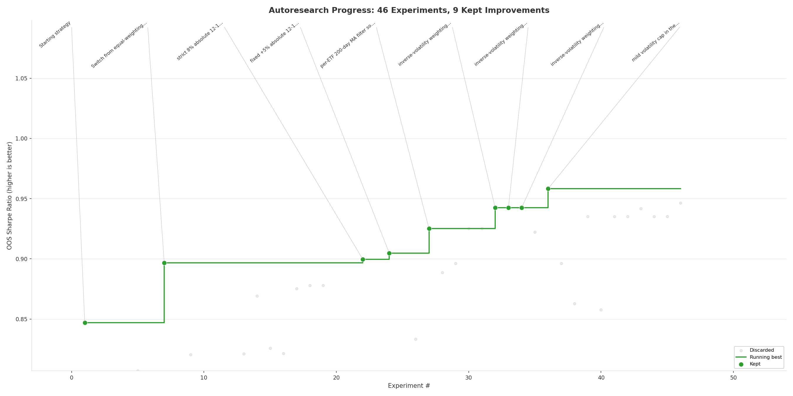

# crucible



*In metallurgy, a crucible is the vessel where raw metals are subjected to extreme heat until only the purest alloy remains. In quantitative finance, the same principle applies — you throw a hundred strategy ideas into the fire and keep only what survives. This repo automates that process. An AI agent proposes changes to a portfolio rotation strategy, backtests them against 18 years of walk-forward history including the 2008 crash, COVID, and the 2022 rate shock, keeps what improves out-of-sample Sharpe, discards the rest, and repeats. You wake up to a log of experiments and a better strategy. —@henri, March 2026*

## How it works

The repo is deliberately kept small. Three files matter:

- **`backtest.py`** — fixed infrastructure. Walk-forward backtester with configurable universe, transaction costs, and risk limits. Downloads data via yfinance on first run. **Not modified by the agent.**
- **`strategy.py`** — the single file the agent edits. Contains the rotation logic: which assets to hold, how to weight them, when to go to cash. Everything is fair game. **This file is edited and iterated on by the agent.**
- **`program.md`** — research guide for the agent. Search space, guiding principles, constraints. **This file is edited and iterated on by the human.**

Each experiment takes ~30 seconds (backtest across 18 walk-forward folds). The metric is **oos_sharpe** (out-of-sample Sharpe ratio across all folds) — higher is better.

The agent uses `git` to version control improvements. `results.tsv` is an append-only experiment log so the agent never repeats itself.

## Quick start

**Requirements:** Python 3.10+, [Claude Code](https://docs.anthropic.com/en/docs/claude-code).

```bash
# 1. Install dependencies
pip install -e .

# 2. Run a single backtest to verify setup (~30s)
python backtest.py

# 3. Start autonomous research (20 batches × 3 experiments = 60 experiments)
bash run_research.sh 20
```

## Changing the universe

Crucible ships with ~40 liquid ETFs spanning equities, bonds, commodities, and real estate. To switch to stocks, crypto, or anything else with a ticker:

1. Edit the `UNIVERSE` list in `backtest.py`
2. Adjust `START_DATE` and cost parameters if needed
3. Delete `data.parquet` (forces re-download)
4. Run `python backtest.py` to verify

The strategy logic in `strategy.py` and the agent instructions in `program.md` are asset-class agnostic — they work on any universe of tickers.

## Running the agent

Point Claude Code at this repo and prompt:

```
Have a look at program.md and let's kick off a new experiment!
```

Or run the automated loop:

```bash
bash run_research.sh 20    # 60 experiments, ~30 min
```

Each batch is a stateless 3-experiment Claude invocation. No context accumulates between batches — the agent reads `results.tsv` and `strategy.py` fresh each time.

## Project structure

```
backtest.py       — walk-forward backtester (do not modify)
strategy.py       — rotation strategy (agent modifies this)
program.md        — agent research guide
research_step.md  — per-batch agent instructions
run_research.sh   — batch runner
plot_progress.py  — generates progress.png (equity curve)
plot_keeps.py     — generates keeps.png (improvement trajectory)
results.tsv       — experiment log (append-only)
pyproject.toml    — dependencies
```

## Design choices

- **Single file to modify.** The agent only touches `strategy.py`. Diffs are small and reviewable.
- **Walk-forward validation.** No in-sample cheating. Every metric is out-of-sample across 18 annual folds spanning different market regimes.
- **Git as checkpoint.** Improvements are committed; failures are reverted. `results.tsv` provides a complete audit trail.
- **Stateless batches.** Each batch starts fresh — the agent reads the current state from files, not memory. This prevents context window bloat and keeps experiments reproducible.
- **Asset-class agnostic.** Swap the ticker list and you're running the same research loop on stocks, crypto, or anything else.

## Acknowledgements

Inspired by Karpathy's [autoresearch](https://github.com/karpathy/autoresearch) — the same idea applied to LLM training on a single GPU. Crucible applies it to portfolio strategy research.

## License

MIT
